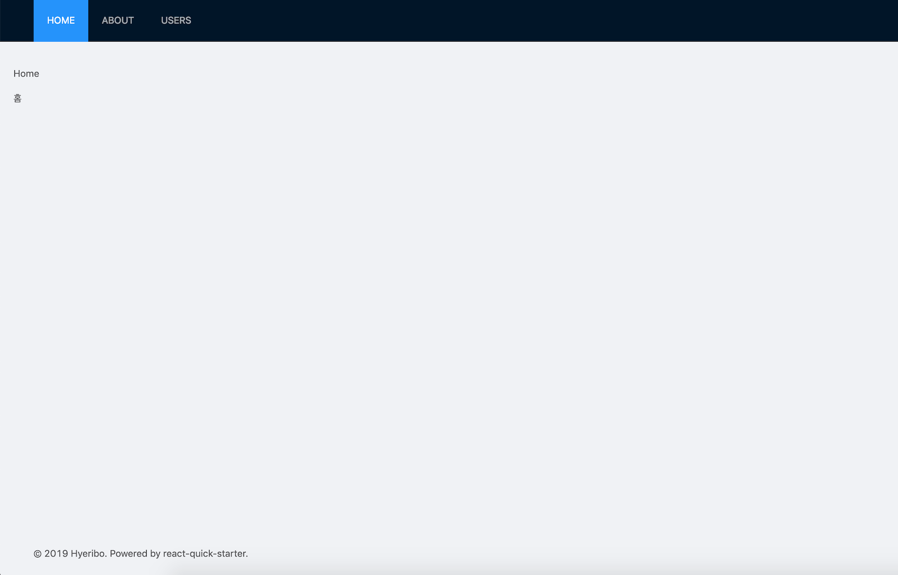

## Installation
```
$ git clone https://github.com/hyeribo/react-quick-starter.git <project-name>
$ cd <project-name>
$ npm install
```

## Running the Project
```
$ npm start
```

## Modules
- react-router-dom v4.3
- styled-components v4.1
- antd v3.15

## Preview

